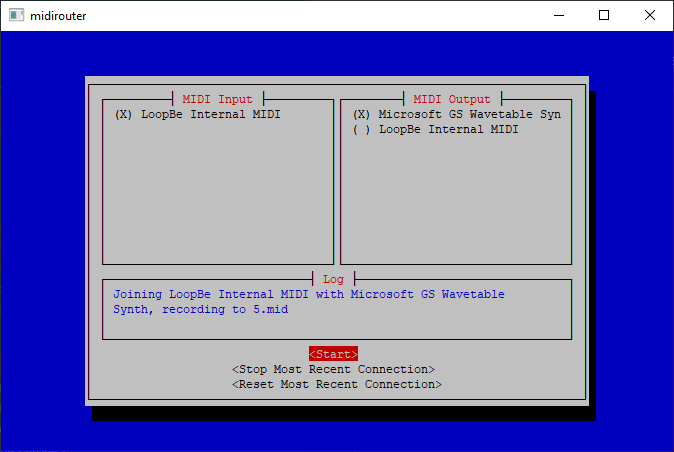

# midirouter 
Route midi messages between Midi devices on your system. Especially powerful when used in conjunction with a MIDI loopback device like [*LoopBe Internal MIDI*](https://www.nerds.de/en/loopbe1.html) or [*MidiYoke*](http://www.midiox.com/index.htm?http://www.midiox.com/myoke.htm).

* Uses the [*Cursive*](https://github.com/Gyscos/Cursive) terminal UI library with the *pancurses* backend.
* Logs all routed midi events to a local midi file 
* Written in *Rust*. Uses multithreading to avoid lag from either the logging or the UI.

# Building
* Clone the repository and run `cargo build` in it's root.

# Download
* Check the releases section for the Windows executable.
* Tested on a linux distro. Users will have to build from source. *Rust* makes this almost trivial. Install the Rust toolchain, clone/download the repo and `cargo run` in it's root.
* Not tested on MacOS, but it *should* build and run easily enough, in theory.
